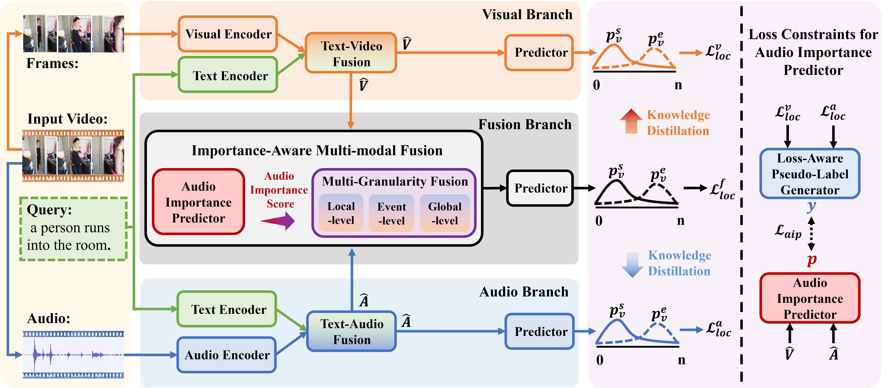

We will soon release our offcial code at [HuiguanLab](https://github.com/HuiGuanLab)

Repo for ACM MM'25 paper "*Audio Does Matter: Importance-Aware Multi-Granularity Fusion for Video Moment Retrieval*". This paper proposes solutions for the Video Moment Retrieval task from an audio-visual collaborative perspective.





Ubuntu 20.04
CUDA 12.0
Python 3.7


1. Set up the environment

Use Anaconda and easily build up the required environment by

```bash
cd IMG
conda env create -f env.yml
```

2. Data Preparation

Follow previous work [ADPN](https://github.com/hlchen23/ADPN-MM), we use GloVe-840B-300d for text embeddings, I3D visual features and PANNs audio features for Charades-STA dataset, and I3D visual features and VGGish audio features for ActivityNet Captions dataset. We have also prepared CLIP and intervideo2 features, the clip features are extracted by ourselves, while internvideo2 features is derived from [here](https://huggingface.co/cg1177). Download [here](https://drive.google.com/drive/folders/1yu9-7SFVUKCbO1dgMcODGdaE1mIBkDsC?usp=sharing) to get Charades-STA features and Activitynet-Caption's audio features and json files, Download [here](https://mega.nz/folder/gv93jDSI#U9Qf1ZuKdP8cIJj5sdK0bw) to get Activitynet-Captions i3d features and glove embeddings, touch `IMG/data/features`, and ensure the following directory structure.

```
|--data
|  |--dataset
|     |--activitynet
|     |     |--train_qid.json
|     |     |--val_1_qid.json
|     |     |--val_2_qid.json
|     |--charades
|     |     |--charades_sta_test_qid.txt
|     |     |--charades_sta_train_qid.txt
|     |     |--charades.json
|     |     |--charades_audiomatter_qid.txt
|     |     |--charades_sta_train_tvr_format.jsonl
|     |     |--charades_sta_test_tvr_format.jsonl
|     |     |--charades_audiomatter_test_tvr_format.jsonl
|  |--features
|     |--activitynet
|     |     |--audio
|     |     |     |--VGGish.pickle
|     |     |--i3d_video
|     |     |     |--feature_shapes.json
|     |     |     |--v___c8enCfzqw.npy
|     |     |     |--...(*.npy)
|     |--charades
|     |     |--audio
|     |     |     |--0A8CF.npy
|     |     |     |--...(*.npy)
|     |     |--i3d_video
|     |     |     |--feature_shapes.json
|     |     |     |--0A8CF.npy
|     |     |     |--...(*.npy)
|     |     |--clip_features
|     |     |     |--visual_features
|     |     |     |     |--0A8CF.npy
|     |     |     |     |--...(*.npy)
|     |     |     |--slowfast_features
|     |     |     |     |--0A8CF.npz
|     |     |     |     |--...(*.npz)
|     |     |     |--text_features
|     |     |     |     |--qid_0.npy
|     |     |     |     |--...(*.npy)
|     |     |--iv2_features
|     |     |     |--visual_features_6b
|     |     |     |     |--0A8CF.pt
|     |     |     |     |--...(*.pt)
|     |     |     |--llama2_txt
|     |     |     |     |--qid0.pt
|     |     |     |     |--...(*.pt)
```


3. Training

```bash
python main.py --task <charades|activitynet|charadesAM> --mode train --gpu_idx <GPU INDEX>
```

4. Inference


```bash
python main.py --task <charades|activitynet|charadesAM> --mode test --gpu_idx <GPU INDEX>
```

Change the config `model_name` in `main.py` to the model_name of `your checkpoint`.


## Acknowledgement

We follow the repo [ADPN](https://github.com/hlchen23/ADPN-MM) and [VSLNet](https://github.com/26hzhang/VSLNet) for the code-running framework to quickly implement our work. We appreciate these great jobs.

<!-- ## Cite

If you feel this repo is helpful to your research, please cite our work.

```
@inproceedings{chen2023curriculum,
  title={Curriculum-Listener: Consistency-and Complementarity-Aware Audio-Enhanced Temporal Sentence Grounding},
  author={Chen, Houlun and Wang, Xin and Lan, Xiaohan and Chen, Hong and Duan, Xuguang and Jia, Jia and Zhu, Wenwu},
  booktitle={Proceedings of the 31st ACM International Conference on Multimedia},
  pages={3117--3128},
  year={2023}
}
``` -->
